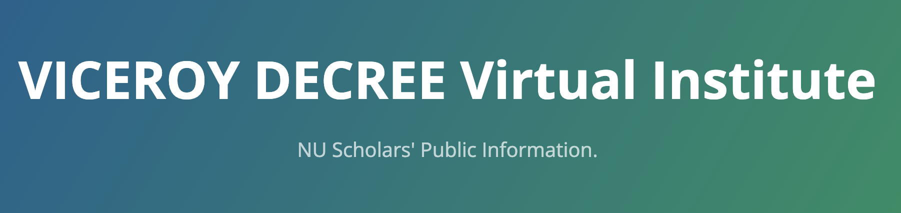

---

### [1. The Viceroy DECREE Virtual Institute](#decree)
### [2. DECREE Scholars' Applications](#applications)
### [3. DECREE Course Curricula](#curricula)
### [4. Become a mentor for DECREE Scholars](#mentors)
### [5. DECREE Calendar](#calendar)

---

# VICEROY DECREE  Virtual Institute <a name="decree"/>

The **DECREE Virtual Institute** (Department of Defense Electromagnetic and Cyber Research and Experiential Education)  is one of the 6 existing **Virtual Institutes for Cyber and Electromagnetic Spectrum Research and Employ (VICEROY)** awarded by the [Griffiss Institute](https://www.griffissinstitute.org/about-us/gi-news/news-story/griffiss-institute-selects-universities-as-viceroy-national-hubs-to-boost-stem-students-into-cyber-defense).

The VICEROY DECREE Virtual Institute is a consortium of 5 universities (Northern Arizona University, University of Houston, University of South Carolina, University of Texas – Austin, and Northeastern University as the lead) to provide a shared curriculum in cybersecurity, EMS, strategic foreign languages, and data science in order to increase the pipeline of highly qualified professionals, particularly from historically underserved groups, seeking careers in the DoD and industry partners. Undergraduate Scholars will have the opportunity to take courses and participate in workshops, seminars, and other industry-related events at partner institutions.

The VICEROY DECREE VI will establish a shared curriculum that will deliver advanced cyber, EMS, data science, cryptography, and strategic foreign language education, hands-on practical training, and research opportunities to a cohort of up to 12 Northeastern University undergraduate students and ROTC cadets. The virtual institute will organize and offer multiple events for scholars and mentors to attend to meet and network with industry and DoD partners and to showcase knowledge, skills, and abilities.

---

# Scholars' Applicantions <a name="applications"/>

VICEROY DECREE scholars will have further access to advanced learning, professional development opportunities, and mentorships until Spring 2024 in preparation for cyber and EMS careers within the Department of Defense and/or defense industry.

**Eligibility Criteria:**
+ Must be **undergraduate student enrolled full-time** at Northeastern University (preferably sophomore or junior)
+ Must fulfill specific academic requirements and course pre-requisites 
+ Must be security-clearance eligible

**[Download Application form here](./doc/decreeapp.pdf)**

The application process is described in the following flow-chart:

---

# The DECREE courses Curricula <a name="curricula"/>
Decree scholars can take courses from a shared virtual institute curriculum. These courses  will follow a virtual online instructional method for Visiting VI students. Each scholar **needs to complete 8-10 Credits** from this multi-institution curriculum (courses credits can vary from 3 to 4 credit hours).

Depending on scholars' background they can select courses which complement their skills and knowledge  based on **breadth** or **depth**
  - Courses complement existing student’s background and skills
  - Courses amplifying and extending existing student’s background and skills

Course curricula is divided into the following areas: 
  - (A1) Electro-Magnetic Spectrum
  - (A2) Cybersecurity
  - (A3) Cryptography
  - (A4) Data Science
  - (A5) Strategic Foreing Language

+ You can see the list of [courses curricula here](./list.md)

--- 

# Become a Mentor for DECREE VI <a name="mentors"/>

VICEROY DECREE Virtual Institute is seeking **mentors with backgrounds in Cybersecurity, Electromagnetic Spectrum, Cryptography, and/or Data Science**.

Each mentor will engage with VICEROY DECREE VI scholarship recipients to act as a role model, participate in regular monthly gatherings to provide career guidance in DoD and DIB careers, participate in networking events with scholars and our industry partners and in DECREE informational sessions with high school students, and support advertising and communicating Train the Trainer opportunities to community colleges.

> Mentors will be provided with a small stipend for their participation and efforts.

---

## Calendar <a name="calendar"/> 

<iframe src="https://calendar.google.com/calendar/embed?height=600&wkst=1&bgcolor=%23ffffff&ctz=America%2FNew_York&showTitle=0&showCalendars=1&showPrint=1&src=bnVkZWNyZWVAZ21haWwuY29t&color=%23039BE5" style="border:solid 1px #777" width="800" height="600" frameborder="0" scrolling="no"></iframe>

---

## Contact us

[viceroydecree@khoury.northeastern.edu](mailto:viceroydecree@khoury.northeastern.edu)

