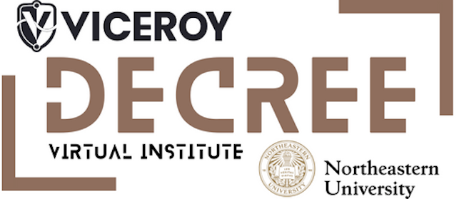

<!--

-->
<!--

<h1 align="center"> Fall 2024 Application Deadline June 7th 2024 </h1>
<h2 align="center"> Interested? </h2>
<h3 align="center"> <a href="https://neu.co1.qualtrics.com/jfe/form/SV_aYuDzdj1O3UYsXI">Register for our ON-LINE INFORMATION SESSION on June 3rd 10AM  2024 (EST).</a> </h3>
<h3 align="center">   </h3>
<h2 align="center">  </h2>

-->

---
### [1. The Viceroy DECREE Virtual Institute](#decree)
### [2. DECREE Scholars' Applications](#applications)
### [3. DECREE Course Curricula](#curricula)
### [4. Scholars DECREE Accreditation Path](#path)
### [5. Become a mentor for DECREE Scholars](#mentors)
### [6. Internships and Opportunities for Viceroy Decree Scholars](#interns)
### [8. Cyber and EMS Careers](#careers)
### [DECREE Calendar](#calendar)

---
<!-- -->
<h3 align="center"> <a href="https://calendar.google.com/calendar/ical/nudecree%40gmail.com/public/basic.ics"> Suscribe to our Calendar </a> </h3>
<h3 align="center">   </h3>
<h2 align="center">  </h2>

---

# 1. VICEROY DECREE  Virtual Institute <a name="decree"/>

The VICEROY DECREE Virtual Institute is a consortium of 4 universities (Northern Arizona University, University of Houston, University of South Carolina, and Northeastern University as the lead) to provide a shared curriculum in cybersecurity, EMS, strategic foreign languages, and data science in order to increase the pipeline of highly qualified professionals, particularly from historically underserved groups, seeking careers in the DoD and industry partners. Undergraduate Scholars will have the opportunity to take courses and participate in workshops, seminars, and other industry-related events at partner institutions.

The DECREE Virtual Institute (Department of Defense Electromagnetic and Cyber Research and Experiential Education)  is one of the 13 existing [Virtual Institutes for Cyber and Electromagnetic Spectrum Research and Employ (VICEROY)](https://www.viceroyscholars.org) awarded by the [Griffiss Institute](https://www.griffissinstitute.org/about-us/gi-news/news-story/griffiss-institute-selects-universities-as-viceroy-national-hubs-to-boost-stem-students-into-cyber-defense).

The [VICEROY DECREE VI](https://news.northeastern.edu/2022/04/25/cyber-warfare-initiative/) will establish a shared curriculum that will deliver advanced cyber, EMS, data science, cryptography, and strategic foreign language education, hands-on practical training, and research opportunities to a cohort of Northeastern University undergraduate students and ROTC cadets. The virtual institute will organize and offer multiple events for scholars and mentors to attend to meet and network with industry and DoD partners and to showcase knowledge, skills, and abilities.

>Funding for VICEROY Decree provided by the Office of the Undersecretary of Defense for Research and Engineering, in collaboration with the Air Force Research Laboratory and Griffiss Institute.

---

# 2.  DECREE Scholars' Applications <a name="applications"/>

Northeastern University is seeking applications from current undergraduate students to join our inaugural cohort of VICEROY DECREE scholars. 

The Virtual Institutes for Cyber and Electromagnetic Spectrum Research and Employ (VICEROY) DoD Electromagnetic and Cyber Research and Experiential Education Virtual Institute (DECREE) is a consortium of four universities created in close collaboration with the Department of Defense (DoD) and Defense Information Base partners to address recruitment and training challenges faced in DoD-related cyber and Electromagnetic Spectrum (EMS) fields. The goal of the program is to grow the availability of well-qualified and trained students with essential knowledge, skills, and abilities required to plan, synchronize, and lead DoD-related cyber and EMS operations.  

VICEROY DECREE scholars will receive a scholarship of up to $10,000 to participate in a virtual curriculum focused on cybersecurity, electromagnetic spectrum operations, data science, cryptography, and strategic foreign languages offered by a consortium of institutions.  

Scholars will be eligible to take virtual, credit-bearing coursework from consortium institutions, have access to mentoring programs, as well as access to DoD-related internships, co-ops, and post-graduation employment opportunities. Scholars will be required to complete 8-10 credits within the VICEROY DECREE designated curriculum by the end of the spring 2024 semester, with at least one-third of credits taken outside their home institution.

**Eligibility Criteria:**
+ Must be **undergraduate student enrolled full-load** at Northeastern University (preferably sophomore or junior)
+ Must fulfill specific academic requirements and course pre-requisites 
+ Must be security-clearance eligible

**[Download Application form here](./doc/decreeapp.pdf)**
### --- The next Priority Application Deadline for Fall 2024 application is June 7th 2024 ---

The application process is described in the following flow-chart:

---

# 3. The DECREE courses Curricula <a name="curricula"/>
Decree scholars can take courses from a shared virtual institute curriculum. These courses  will follow a virtual online instructional method for Visiting VI students. Each scholar **needs to complete 8-10 Credits** from this multi-institution curriculum (courses credits can vary from 3 to 4 credit hours).  
+ Students must have completed at least one semester of full-time study at the Home Institution before participating in an Exchange Program. 

Depending on scholars' background they can select courses which complement their skills and knowledge  based on **breadth** or **depth**
  - Courses complement existing student’s background and skills
  - Courses amplifying and extending existing student’s background and skills

Course curricula is divided into the following areas: 
  - Electro-Magnetic Spectrum
  - Cybersecurity
  - Cryptography
  - Data Science
  - Strategic Foreing Language
  - Research

+ You can find the list of [courses curricula here](./list.md)
+ **The upcoming Registrations deadlines are:**
   -  South Carolina
       - Summer 2024 --> May 1st
       - Fall 2024 --> July 1st
   - Northern Arizona
       - Fall 2024 --> September 5th
   - Northeastern University
       - Fall 2024 --> September 4th
  >> **It is importnat to start the process ASAP through your `VICEROY DECREE PoC', because courses are very popular and fill up soon**
--- 

# 4. Scholars DECREE Accreditation Path <a name="path"/>
![](https://www.plantuml.com/plantuml/png/XLR1RkCs4BtpAmQRGmzjikcXHR67OXUA5mZGROnri42FD3MoY5AaC1pPKB--r4YcB2j63a4qR_WUPvweeJz7riHTuzHFqMY7yFjlZr2ZFTISaST7EDcIQ-MmOk00DAIXj8I6RV2gjYK2DYttK68qP5k1bKhYZF3XntEn-Vxo3pnjYk-R3HGltxP_RLwVN_x-03g22KthS630NO_EXLCc5cCApymVpr1qHDPqhcj6SWxXpWrbJGep_WbsfWvE4tZ4SYZVd5MjJo5h1tyCyA-FvsqCOMavFYnKlZ0ur94XU4mI7KK4pQ2XrSGUAQb5jjn9wxSQA3Bl3POqDE7J1dUdsZA-8nS7lJeqU2qcu7jAuGaA9BQLDJeJpIMoT7QH-WIlfo0QMmeLnfWmxKHmMX6l2K_OeY-jFq1IZkEhYR3Nvjy3XSwNeDFVoN8DskWI6sj0bqSR0u5kMmf7xNw1m3NIiie8HdlO8tGHomTGQjth3ar7blkVfSSuHPCrgzLRz8oHnyNj6DoqyQMgq4Txd3S19crzwbFu8USNPcOudzAuFgRxr6rM4tkArwzoKAonhJJ_iAv86nwsQmdJIbaar0KDh1UjOIjaExz-hh8hxpVwcXkTZK9oUd_jrZRlBT_UrLZOzKqROhJJbnqbjDSVjhgbDgb4RApN5ANPpH4zHv53ULngZTWRrcjczEKy4RBgG-PCYIPjepbGVzx0XCupL860QysGQBP9FOHgNB3qFxxJJA23zlO_B1DMTf6f_qWOKPEfSqb3TpcO7B-XkgfvzcS6pnBh4_KDFGUAy16sY7JVI0WjXGFfyPsDq9NB8_YMpGqY0-6XIwZhvQFF4k6817feJ4xJmopp1GWhDruzGDW6ugounw6UiZCftFUJ6AJMv17nvkdPZbqaHxJhvZc8ELpsj9eLXFUxZexO2wqbZ1BTd2qXyeAGuZSPSprWFICTBPw4aQCpOTxp_lxFYy9LrbvbiiPrOjhyg_NQdMSqEDGa4sZqN5pDRqBiok4DkxOoYn1st9Ne6GeTKNXn14oAv_up9DNDqkhYMfRKnGy8KClxKz9vjShtuIgJBmF15xUVcaRQEgNK8hmkHkKHjifahzUawPolS6Mu4Z3V6MenQvUf_BJMoL-wfCQnfV80kS36Vsk1-LMiSv_HbrtZ_WS0)

# 5. Become a Mentor for DECREE VI <a name="mentors"/>

VICEROY DECREE Virtual Institute is seeking **mentors with backgrounds in Cybersecurity, Electromagnetic Spectrum, Cryptography, and/or Data Science**.

Each mentor will engage with VICEROY DECREE VI scholarship recipients to act as a role model, participate in regular monthly gatherings to provide career guidance in DoD and DIB careers, participate in networking events with scholars and our industry partners and in DECREE informational sessions with high school students, and support advertising and communicating Train the Trainer opportunities to community colleges.

> Mentors will be provided with a small stipend for their participation and efforts.

---
# 6. Applications for interns for Viceroy Summer Program <a name="interns"/>
 
**VICEROY 2025 Summer program** 
Here is the 2025 Application for interns for  VICEROY  Summer program. 
VICEROY internship applications are now live through a soft launch and can be accessed at the following link: [VICEROY Internship Application](https://www.viceroyscholars.org/about-us/apply/).

---
# 7. Cyber and EMS Careers <a name="careers"/>

1.	https://www.disa.mil/careers
2.	https://www.cybercom.mil/Employment-Opportunities/
3.	https://www.nsa.gov/careers/
4.	https://www.goarmy.com/careers-and-jobs/specialty-careers/army-cyber.html
5.	https://www.airforce.com/careers/in-demand-careers/cyber
6.	https://afresearchlab.com/careers-and-opportunities/students-and-faculty/
7.	https://www.navy.com/careers/cyber-warfare-engineer
8.	https://www.gocoastguard.com/active-duty-careers/officer-opportunities/programs/direct-commission-cyber-officer-dcco

##### 7 Other Oportunitites
 
+ [https://ignite.ll.mit.edu/ignite/](https://ignite.ll.mit.edu/ignite/)
 
+ The Army’s direct commissioning program for cyber:
   - [https://talent.army.mil/job/cyber-officer/](https://talent.army.mil/job/cyber-officer/)
   - [https://www.smartscholarship.org/smart/en](https://www.smartscholarship.org/smart/en)

---
## Calendar <a name="calendar"/> 

<iframe src="https://calendar.google.com/calendar/embed?height=600&wkst=1&bgcolor=%23ffffff&ctz=America%2FNew_York&showTitle=0&showCalendars=1&showPrint=1&src=bnVkZWNyZWVAZ21haWwuY29t&color=%23039BE5" style="border:solid 1px #777" width="800" height="600" frameborder="0" scrolling="no"></iframe>

---

## Contact us

[viceroydecree@khoury.northeastern.edu](mailto:viceroydecree@khoury.northeastern.edu)

