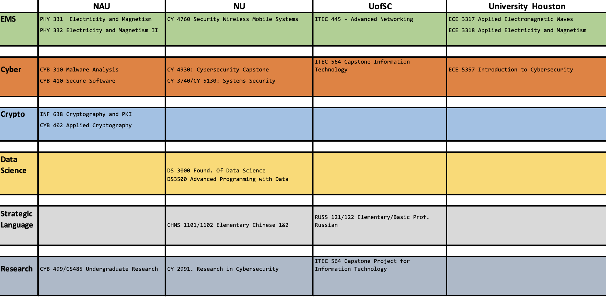

## DECREE VI Curricula

This content is  subject to change. You need con confirm with the offering institution

This curricula is organized by the consortium University offer:
+ [Northeastern University](#NU)
+ [Northen Arizona University](#NAU)
+ [University of Houston](#HOU)
+ [University of South Carolina](#USC)

---
##### You can find syllabus for most of these courses, however courses content may vary and the syllabus just provides a preliminary content of the course based on previous semesters.
---
## Courses by topic and univerisity

> Course details are provided bellow

---
### Northeastern University 

### CY 2991. Research in Cybersecurity (4 credits)

*Offered Fall and Spring* 
Description: Offers an opportunity to conduct introductory-level research or creative endeavors under faculty supervision.  

> VICEROY DECREE Virtual Institute Students will focus their research area into those determined by the VICEROY special interest areas. 

Prerequisites: Permission of the instructor.

 

#### CY 3740/CY 5130: Systems Security (4 credits)   
[Syllabus](./courses/NUCY3740.pdf)
*Offered Fall 2022* 

+ Description: Offers a practical overview of enterprise computer security, operating systems security, and related topics. Applies concepts such as authentication, access control, integrity, and audit to the modern operating system. Discusses and demonstrates system, process, memory, and filesystem-level defenses and the attacks against them. Also discusses topics in systems security assessment and cloud security. 

+ Prerequisites: Good understanding of the Linux command line, python and C languages, and experience using docker containers. 

+ Workforce Framework for Cybersecurity (NICE Framework) 

   |Knowledge ID| Work Role |
   |------------|-----------|
   |[K0290](https://niccs.cisa.gov/workforce-development/nice-framework/knowledges/k0290)| [Systems Security Analyst](https://niccs.cisa.gov/workforce-development/nice-framework/work-roles/systems-security-analyst)|
   |  | [Cyber Defense Analyst](https://niccs.cisa.gov/workforce-development/nice-framework/work-roles/cyber-defense-analyst)|
 

#### CY 4760/6760: Security of Wireless and Mobile Systems (4 credits)   
[Syllabus](./courses/NUCY4760.pdf)

*Offered Spring 2023* 

+ Description: This course focuses on Security and Privacy in Mobile and Wireless Systems. Recent years have seen massive deployment of wireless devices and technologies around us. They are deployed in a wide variety of systems such as telephony, navigation, sensor networks, critical infrastructures etc. With the advent of the Internet of Things and autonomous cyber-physical systems, the proliferation of these wireless systems is only bound to increase. The broadcast nature of wireless technologies and the increased availability of software defined radios have not only improved quality of life but pose significant security challenges. 

This course provides the foundations to understand the security and privacy threats and defenses in wireless and mobile systems especially in the era of softwarization of wireless networks. After this course, the students should be able to describe and classify security goals and attacks in modern wireless networks. They should be able to identify the unique security implications of these effects and how to mitigate security issues associated with them. 

+ Workforce Framework for Cybersecurity (NICE Framework) 

   |Knowledge ID| Work Role |
   |------------|-----------|
   |[K0438](https://niccs.cisa.gov/workforce-development/nice-framework/knowledges/k0438)| [Cyber Operator](https://niccs.cisa.gov/workforce-development/nice-framework/work-roles/cyber-operator)|
   |[K0269](https://niccs.cisa.gov/workforce-development/nice-framework/knowledges/k0269) | [Research & Development Specialist](https://niccs.cisa.gov/workforce-development/nice-framework/work-roles/research-development-specialist)|

#### DS 3000 Foundations of Data Science (4 credits)
 [Syllabus](./courses/NUDS3000.pdf). 

+ Description: Introduces core modern data science technologies and methods that provide a foundation for subsequent Data Science classes. Covers: working with tensors and applied linear algebra in standard numerical computing libraries (e.g., NumPy); processing and integrating data from a variety of structured and unstructured sources; introductory concepts in probability, statistics, and machine learning; basic data visualization techniques; and now standard data science tools such as Jupyter notebooks.

+ Prerequisite(s): CS 2510 or DS 2500 

+ Workforce Framework for Cybersecurity (NICE Framework) 

   |Knowledge ID| Work Role |
   |------------|-----------|
   |[K0020](https://niccs.cisa.gov/workforce-development/nice-framework/knowledges/k0020)| [Database Administrator](https://niccs.cisa.gov/workforce-development/nice-framework/work-roles/database-administrator)|
   || [Data Analyst](https://niccs.cisa.gov/workforce-development/nice-framework/work-roles/data-analyst)|
   |[K0022](https://niccs.cisa.gov/workforce-development/nice-framework/knowledges/k0022)| [Database Administrator](https://niccs.cisa.gov/workforce-development/nice-framework/work-roles/database-administrator)|
   || [Data Analyst](https://niccs.cisa.gov/workforce-development/nice-framework/work-roles/data-analyst)|
   |[K0083](https://niccs.cisa.gov/workforce-development/nice-framework/knowledges/k0083)| [Database Administrator](https://niccs.cisa.gov/workforce-development/nice-framework/work-roles/database-administrator)|
   || [Data Analyst](https://niccs.cisa.gov/workforce-development/nice-framework/work-roles/data-analyst)|
   |[K0065](https://niccs.cisa.gov/workforce-development/nice-framework/knowledges/k0065)| [Database Administrator](https://niccs.cisa.gov/workforce-development/nice-framework/work-roles/database-administrator)|
   || [Data Analyst](https://niccs.cisa.gov/workforce-development/nice-framework/work-roles/data-analyst)|
   || [Cyber Defense Analyst](https://niccs.cisa.gov/workforce-development/nice-framework/work-roles/cyber-defense-analyst)|
   || [Information Systems Security Developer](https://niccs.cisa.gov/workforce-development/nice-framework/work-roles/information-systems-security-developer)|
   || [Systems Developer](https://niccs.cisa.gov/workforce-development/nice-framework/work-roles/systems-developer)|

#### DS 3500 Advanced Programming with Data (4 credits)
 [Syllabus](./courses/NUDS3500.pdf). 
 
+ Description: Provides a deep-dive into the design and implementation of enterprise-grade software systems with an emphasis on software architectures for more complex data-driven applications. Covers extensible architectures that support testing, data provenance, reuse, maintainability, scalability, and robustness; building software APIs and libraries for wide-scale adoption and ease-of-use. Students will learn how to design implement and test complex loosely-coupled service-oriented architectures and will learn how to use the python programming language for distributed processing, stream-based data processing, and inter-process communication via message-passing. Homework assignments will center around a semester-long project exploring various topical machine learning themes possibly including but not limited to: library construction for data cleansing, analysis, and data mining, sentiment analysis and natural-language processing, scientific computing problems in bioinformatics, astronomical data analysis, or healthcare. Student will explore the features, capabilities, and underlying design of popular data analysis and visualization frameworks. 

+ Prerequisites: DS2000,DS2500

+ Workforce Framework for Cybersecurity (NICE Framework) 

    |Knowledge ID| Work Role |
   |------------|-----------|
   |[K0020](https://niccs.cisa.gov/workforce-development/nice-framework/knowledges/k0020)| [Database Administrator](https://niccs.cisa.gov/workforce-development/nice-framework/work-roles/database-administrator)|
   || [Data Analyst](https://niccs.cisa.gov/workforce-development/nice-framework/work-roles/data-analyst)|
   |[K0022](https://niccs.cisa.gov/workforce-development/nice-framework/knowledges/k0022)| [Database Administrator](https://niccs.cisa.gov/workforce-development/nice-framework/work-roles/database-administrator)|
   || [Data Analyst](https://niccs.cisa.gov/workforce-development/nice-framework/work-roles/data-analyst)|
   |[K0083](https://niccs.cisa.gov/workforce-development/nice-framework/knowledges/k0083)| [Database Administrator](https://niccs.cisa.gov/workforce-development/nice-framework/work-roles/database-administrator)|
   || [Data Analyst](https://niccs.cisa.gov/workforce-development/nice-framework/work-roles/data-analyst)|
   |[K0065](https://niccs.cisa.gov/workforce-development/nice-framework/knowledges/k0065)| [Database Administrator](https://niccs.cisa.gov/workforce-development/nice-framework/work-roles/database-administrator)|
   || [Data Analyst](https://niccs.cisa.gov/workforce-development/nice-framework/work-roles/data-analyst)|
   || [Cyber Defense Analyst](https://niccs.cisa.gov/workforce-development/nice-framework/work-roles/cyber-defense-analyst)|
   || [Information Systems Security Developer](https://niccs.cisa.gov/workforce-development/nice-framework/work-roles/information-systems-security-developer)|
   || [Systems Developer](https://niccs.cisa.gov/workforce-development/nice-framework/work-roles/systems-developer)|

#### CY 4930: Cybersecurity Capstone (4 credits)     
 [Syllabus](./courses/NUCY4930.pdf)

*Offered Spring 2023* 

+ Description: Provides the culmination of the learned principles and methodologies for identifying and addressing Cybersecurity issues in organizations. Students bring their individual skills and abilities to create a solution to a real-world cybersecurity problem/challenge. Students will work in small groups to identify and scope the information security problem/challenge, create a project plan to develop a solution to include the development and identification of the data necessary to properly solve the problem/challenge, develop a final report (whose intended audience are senior business executives) and participate in the MSCY Capstone Event to present the results they have obtained. Further the students will be required to manage and develop the project using some SCRUM methodology tools. In this way, sprints will be planned for each project and the team will deliver the product after each sprint iteratively and incrementally, maximizing opportunities for feedback. 

#### CHNS 1101: Elementary Chinese 1 (4 credits)    
 [Syllabus](./courses/NUCHNS1101.pdf)

*Offered Fall and Spring* 

+ Description: This course is designed for students with little or no prior knowledge of Chinese. With its holistic focus on the four language skills of listening, speaking, reading and writing, the course helps students build a solid foundation in language form and accuracy, and prepares them to function in a Chinese language environment. Students will learn not only how the Chinese language works grammatically, but will also learn to use Chinese in real life. 

 

+ Prerequisites: None 
+ Workforce Framework for Cybersecurity (NICE Framework) 

    |Knowledge ID| Work Role |
   |------------|-----------|
   |[K0550](https://niccs.cisa.gov/workforce-development/nice-framework/knowledges/k0550)| [Multi-Disciplined Language Analyst](https://niccs.cisa.gov/workforce-development/nice-framework/work-roles/multi-disciplined-language-analyst)|
   |[K0545](https://niccs.cisa.gov/workforce-development/nice-framework/knowledges/k0545)| [Multi-Disciplined Language Analyst](https://niccs.cisa.gov/workforce-development/nice-framework/work-roles/multi-disciplined-language-analyst)|
   |[K0416](https://niccs.cisa.gov/workforce-development/nice-framework/knowledges/k0416)| [Multi-Disciplined Language Analyst](https://niccs.cisa.gov/workforce-development/nice-framework/work-roles/multi-disciplined-language-analyst)|
   |[K0407](https://niccs.cisa.gov/workforce-development/nice-framework/knowledges/k0407)| [Multi-Disciplined Language Analyst](https://niccs.cisa.gov/workforce-development/nice-framework/work-roles/multi-disciplined-language-analyst)|
   |[K0476](https://niccs.cisa.gov/workforce-development/nice-framework/knowledges/k0476)| [Multi-Disciplined Language Analyst](https://niccs.cisa.gov/workforce-development/nice-framework/work-roles/multi-disciplined-language-analyst)|
   |[K0574](https://niccs.cisa.gov/workforce-development/nice-framework/knowledges/k0574)| [Multi-Disciplined Language Analyst](https://niccs.cisa.gov/workforce-development/nice-framework/work-roles/multi-disciplined-language-analyst)|

   
---
---
 

### Northern Arizona University 

#### PHY 599 - Advanced Electricity and Magnetism

#### PHY 331 - Electricity and Magnetism I (3 credits)     
[Syllabus](./courses/NAUPHY331.pdf)

*Offered Spring TBD * 

+ Description: Electrostatistics, magnetostatistics, Lorentz force, fields in matter, electromagnetic induction. Letter grade only. 

+ Prerequisites: PHY 263 and (PHY 265 or CS 122) and (MAT 238 or higher) 

 

#### PHY 332 - Electricity and Magnetism II (3 credits)

*Offered Fall TBD* 

+ Description: Maxwell's equations, scalar and vector potentials, Laplace's equation, boundary value problems, plane waves, and radiation. Letter grade only. 

+ Prerequisites: PHY 263 and (PHY 265 or CS 122) and (MAT 238 or higher) 

 

#### CYB 310 Malware Analysis (3 credits)   
 [Syllabus](./courses/NAUCYB310.pdf)

*Offered Spring 2023* 

+ Description: Introduction to reverse engineering techniques for the identification, classification, and analysis of malware using disassembly, virtual machines, static analysis, and dynamic analysis. Letter grade only. 

+ Prerequisite: CS 205, CYB 136, and MAT 226 with grades of C or better in each 
 
+ Workforce Framework for Cybersecurity (NICE Framework) 

    |Knowledge ID| Work Role |
   |------------|-----------|
   |[K0259](https://niccs.cisa.gov/workforce-development/nice-framework/knowledges/k0259)| [Cyber Defense Incident Responder](https://niccs.cisa.gov/workforce-development/nice-framework/work-roles/cyber-defense-incident-responder)|
   |[K0188](https://niccs.cisa.gov/workforce-development/nice-framework/knowledges/k0188)| [Law Enforcement / Counterintelligence Forensics Analyst](https://niccs.cisa.gov/workforce-development/nice-framework/work-roles/law-enforcementcounterintelligence-forensics)|
   || [Cyber Defense Forensics Analyst](https://niccs.cisa.gov/workforce-development/nice-framework/work-roles/cyber-defense-forensics-analyst)|
   |[K0479](https://niccs.cisa.gov/workforce-development/nice-framework/knowledges/k0479)| [Target Developer](https://niccs.cisa.gov/workforce-development/nice-framework/work-roles/target-developer)|
   || [Target Network Analyst](https://niccs.cisa.gov/workforce-development/nice-framework/work-roles/target-network-analyst)|

#### CYB 410 Secure Software (3 credits)
[Syllabus](./courses/NAUCYB410.pdf)

* Offered Fall * 

+ Description: Covers a broad array of topics in software security and security engineering that concern software systems. Famous vulnerabilities will be examined (e.g., Heartbleed and Apple's "goto fail") with an emphasis on how such problems can be prevented, detected, and exploited. Letter grade only. 

+ Prerequisite: (CS 249 or CYB 404), CS 305 

 + Workforce Framework for Cybersecurity (NICE Framework) 

    |Knowledge ID| Work Role |
   |------------|-----------|
   |[K0479](https://niccs.cisa.gov/workforce-development/nice-framework/knowledges/k0479)| [Target Developer](https://niccs.cisa.gov/workforce-development/nice-framework/work-roles/target-developer)|
   || [Target Network Analyst](https://niccs.cisa.gov/workforce-development/nice-framework/work-roles/target-network-analyst)|

#### CYB486 Capstone

Students are encouraged to gain experience in their chosen field(s) by undertaking educational experiences outside of regular class work by pursuing credit for Individualize Studies. Academic credit for this work is offered through University Course Lines that can be offered under the course prefix of the supporting unit in which the experienced is offered. Departments may limit the number of credit hours that can be taken in any instance and that can be used towards meeting major or minor requirements. Check with your major or minor department for its policy.

*Offered* **Spring 2023** 

+ Description: Examines recent trends and investigations in a selected area. Letter grade only. 

> VICEROY DECREE Virtual Institute Students will focus their research  into those determined by the VICEROY special interest areas. 

 

#### CYB 402 Applied Cryptography (3 credits)
 [Syllabus](./courses/NAUCYB402.pdf)

*Offered Fall 2022* 

+ Description: A practice-oriented approach to cryptography with topics in encryption, randomness, cryptographic security, block ciphers, stream ciphers, hash functions, keyed hashing, authentication, computational complexity, RSA, elliptic curve cryptography, TLS, and post-quantum cryptography. Co-convened with CYB 502. 

+ Prerequisite: CS 205, CYB 136, MAT 226, and (STA 270 or STA 275) with grades of C or better in each letter grade only. 

+ Workforce Framework for Cybersecurity (NICE Framework) 

    |Knowledge ID| Work Role |
   |------------|-----------|
   |[K0019](https://niccs.cisa.gov/workforce-development/nice-framework/knowledges/k0019)| [Systems Security Analyst](https://niccs.cisa.gov/workforce-development/nice-framework/work-roles/systems-security-analyst)|
   || [Cyber Defense Analyst](https://niccs.cisa.gov/workforce-development/nice-framework/work-roles/cyber-defense-analyst)|
   || [Vulnerability Assessment Analyst](https://niccs.cisa.gov/workforce-development/nice-framework/work-roles/vulnerability-assessment-analyst)|
   || [Security Architect](https://niccs.cisa.gov/workforce-development/nice-framework/work-roles/security-architect)|
   || [Authorizing Offical/Designating Representative](https://niccs.cisa.gov/workforce-development/nice-framework/work-roles/authorizing-officialdesignating-representative)|
   || [Security Control Assessor](https://niccs.cisa.gov/workforce-development/nice-framework/work-roles/security-control-assessor)|
   || [Systems Requirements Planner](https://niccs.cisa.gov/workforce-development/nice-framework/work-roles/systems-requirements-planner)|
   || [Research & Development Specialist](https://niccs.cisa.gov/workforce-development/nice-framework/work-roles/research-development-specialist)|
   |[K0196](https://niccs.cisa.gov/workforce-development/nice-framework/knowledges/k0196)| [Program Manager](https://niccs.cisa.gov/workforce-development/nice-framework/work-roles/program-manager)|
   || [IT Project Manager](https://niccs.cisa.gov/workforce-development/nice-framework/work-roles/it-project-manager)|
   || [Product Support Manager](https://niccs.cisa.gov/workforce-development/nice-framework/work-roles/product-support-manager)|

#### CYB 410 Secure Software (3 credits)
 [Syllabus](./courses/NAUCYB410.pdf)

*Offered Fall 2022* 

+ Description: This course prepares students to understand and defend against software attacks through static and dynamic analysis of software systems. The course requires prior experience with software development and network security. This course explores cutting edge tools used in software system analysis and design, which develops critical skills needed in CYB 486C Capstone. By developing the skills to understand and analyze software systems, students also learn how software exploits can be discovered and can be guarded against in advanced software engineering practice. This is a required course in the B.S. in Cybersecurity curriculum and a pre-requisite for CYB 486C. This class also directly supports several program student outcomes through its subject matter, student learning, activities, and assessment (student outcomes 1, 2, and 6).

+ Prerequisite: Pre-requisites: (CS249 or CYB 404) and CS 305. 

+ Workforce Framework for Cybersecurity (NICE Framework) 

    |Knowledge ID| Work Role |
   |------------|-----------|
   |[K0479](https://niccs.cisa.gov/workforce-development/nice-framework/knowledges/k0479)| [Target Developer](https://niccs.cisa.gov/workforce-development/nice-framework/work-roles/target-developer)|
   || [Target Network Analyst](https://niccs.cisa.gov/workforce-development/nice-framework/work-roles/target-network-analyst)| 

#### INF 638: Cryptography and Public Key Infrastructure (3 credits)   
 [Syllabus](./courses/NAUINF638.pdf)

*Offered* **Fall 2023** 

+ Description: Study of methods, techniques, and research areas in cryptography and public key infrastructure to strengthen cybersecurity. Letter grade only. 

+ Prerequisites: Graduate status 

+ Workforce Framework for Cybersecurity (NICE Framework) 

    |Knowledge ID| Work Role |
   |------------|-----------|
   |[K0019](https://niccs.cisa.gov/workforce-development/nice-framework/knowledges/k0019)| [Systems Security Analyst](https://niccs.cisa.gov/workforce-development/nice-framework/work-roles/systems-security-analyst)|
   || [Cyber Defense Analyst](https://niccs.cisa.gov/workforce-development/nice-framework/work-roles/cyber-defense-analyst)|
   || [Vulnerability Assessment Analyst](https://niccs.cisa.gov/workforce-development/nice-framework/work-roles/vulnerability-assessment-analyst)|
   || [Security Architect](https://niccs.cisa.gov/workforce-development/nice-framework/work-roles/security-architect)|
   || [Authorizing Offical/Designating Representative](https://niccs.cisa.gov/workforce-development/nice-framework/work-roles/authorizing-officialdesignating-representative)|
   || [Security Control Assessor](https://niccs.cisa.gov/workforce-development/nice-framework/work-roles/security-control-assessor)|
   || [Systems Requirements Planner](https://niccs.cisa.gov/workforce-development/nice-framework/work-roles/systems-requirements-planner)|
   || [Research & Development Specialist](https://niccs.cisa.gov/workforce-development/nice-framework/work-roles/research-development-specialist)|
   |[K0196](https://niccs.cisa.gov/workforce-development/nice-framework/knowledges/k0196)| [Program Manager](https://niccs.cisa.gov/workforce-development/nice-framework/work-roles/program-manager)|
   || [IT Project Manager](https://niccs.cisa.gov/workforce-development/nice-framework/work-roles/it-project-manager)|
   || [Product Support Manager](https://niccs.cisa.gov/workforce-development/nice-framework/work-roles/product-support-manager)|

 ---
 

### University of Houston 

#### ECE 3317 - Applied Electromagnetic Waves (3 credits)
 [Syllabus](./courses/UHECE3317.pdf)
*Offered Fall 2022* 

+ Description: Maxwell’s equations in time and frequency domains, Poynting’s theorem, plane wave propagation, reflection and transmission in lossless and lossy media, transmission lines, waveguides, and antennas.  

+ Prerequisites:  PHYS 2126 and PHYS 2326   
 

#### ECE 3318 - Applied Electricity and Magnetism (3 credits)
 [Syllabus](./courses/UHECE3318.pdf)
*Offered Spring 2023* 

+ *Description:* Fundamentals of electricity and magnetism, vector calculus, Maxwell’s equations, Kirchoff’s laws, static electric and magentic fields, resistance, capacitance, inductance, magentic circuits, and transformers. 

+ Prerequisites: ENGI 1100, ENGI 1331, MATH 2415, MATH 3321, PHYS 2326, PHYS 2126.  
 

#### ECE 5397 - Introduction to Cybersecurity (3 credits)

 [Syllabus](./courses/UHECE5397.pdf)

*Offered Spring 2023* 

+ Description: Basic security concepts. Cryptography basics. Computer security and network security. Security analysis.  

+ Prerequisites: ECE 1331, ENGI 1100, & MATH 2415.   
 

 ---
 ---

### University of South Carolina 

#### RUSS 121: Introductory Russian (4 credits).   
[Syllabus](./courses/USCRUSS121.pdf)

*Offered Fall 2022* 

+ Description: This course will introduce students to the Russian language and culture by focusing on four essential skills: listening, speaking, reading, and writing.  Students will gain confidence and proficiency in specific communicative tasks and will develop a basic understanding of the structure of the Russian language and the culture of the Russian people, with an emphasis on using language in its cultural context.  

+ Prerequisites: None.

+ Workforce Framework for Cybersecurity (NICE Framework) 

    |Knowledge ID| Work Role |
   |------------|-----------|
   |[K0550](https://niccs.cisa.gov/workforce-development/nice-framework/knowledges/k0550)| [Multi-Disciplined Language Analyst](https://niccs.cisa.gov/workforce-development/nice-framework/work-roles/multi-disciplined-language-analyst)|
   |[K0545](https://niccs.cisa.gov/workforce-development/nice-framework/knowledges/k0545)| [Multi-Disciplined Language Analyst](https://niccs.cisa.gov/workforce-development/nice-framework/work-roles/multi-disciplined-language-analyst)|
   |[K0416](https://niccs.cisa.gov/workforce-development/nice-framework/knowledges/k0416)| [Multi-Disciplined Language Analyst](https://niccs.cisa.gov/workforce-development/nice-framework/work-roles/multi-disciplined-language-analyst)|
   |[K0407](https://niccs.cisa.gov/workforce-development/nice-framework/knowledges/k0407)| [Multi-Disciplined Language Analyst](https://niccs.cisa.gov/workforce-development/nice-framework/work-roles/multi-disciplined-language-analyst)|
   |[K0476](https://niccs.cisa.gov/workforce-development/nice-framework/knowledges/k0476)| [Multi-Disciplined Language Analyst](https://niccs.cisa.gov/workforce-development/nice-framework/work-roles/multi-disciplined-language-analyst)|
   |[K0574](https://niccs.cisa.gov/workforce-development/nice-framework/knowledges/k0574)| [Multi-Disciplined Language Analyst](https://niccs.cisa.gov/workforce-development/nice-framework/work-roles/multi-disciplined-language-analyst)|
 
<!---
#### RUSS 122: Basic Proficiency in Russian  (4 credits).   
 [Syllabus](./courses/USCRUSS122.pdf)

*Offered Spring 2023* 

+ Description: This course will continue to introduce students to the Russian language by focusing on the four essential language skills: listening, speaking, reading, and writing.  Students will gain confidence and proficiency in specific communicative tasks and will develop further their understanding of the structure of the Russian language and the culture of the Russian people, with an emphasis on using language in its cultural context.  

+ Prerequisites: RUSS 121 

+ Workforce Framework for Cybersecurity (NICE Framework) 

    |Knowledge ID| Work Role |
   |------------|-----------|
   |[K0550](https://niccs.cisa.gov/workforce-development/nice-framework/knowledges/k0550)| [Multi-Disciplined Language Analyst](https://niccs.cisa.gov/workforce-development/nice-framework/work-roles/multi-disciplined-language-analyst)|
   |[K0545](https://niccs.cisa.gov/workforce-development/nice-framework/knowledges/k0545)| | 
   |[K0416](https://niccs.cisa.gov/workforce-development/nice-framework/knowledges/k0416)| |
   |[K0407](https://niccs.cisa.gov/workforce-development/nice-framework/knowledges/k0407)| | 
   |[K0476](https://niccs.cisa.gov/workforce-development/nice-framework/knowledges/k0476)| | 
   |[K0574](https://niccs.cisa.gov/workforce-development/nice-framework/knowledges/k0574)| |  
-->

#### ITEC 445: Advanced Networking (3 credits).   
 [Syllabus](./courses/USCITEC445.pdf)

+ Description: This course will cover network infrastructure topics (client/server protocols, routing, switching) with emphasis on hands-on implementations using network operating system software. 

+ Prerequisites: None 

+ Workforce Framework for Cybersecurity (NICE Framework) 

    |Knowledge ID| Work Role |
    |------------|-----------|
    |[K0106](https://niccs.cisa.gov/workforce-development/nice-framework/knowledges/k0106)| [Information Systems Security Manager](https://niccs.cisa.gov/workforce-development/nice-framework/work-roles/information-systems-security-manager)|
    || [Executive Cyber Leadership](https://niccs.cisa.gov/workforce-development/nice-framework/work-roles/executive-cyber-leadership)|
    || [Cyber Defense Analyst](https://niccs.cisa.gov/workforce-development/nice-framework/work-roles/cyber-defense-analyst)|
    || [Cyber Defense Infrastructure Support Specialist](https://niccs.cisa.gov/workforce-development/nice-framework/work-roles/cyber-defense-infrastructure-support-specialist)|
    || [Cyber Defense Incident Responder](https://niccs.cisa.gov/workforce-development/nice-framework/work-roles/cyber-defense-incident-responder)|
    || [Vulnerability Assessment Analyst](https://niccs.cisa.gov/workforce-development/nice-framework/work-roles/vulnerability-assessment-analyst)|
    |[K0033](https://niccs.cisa.gov/workforce-development/nice-framework/knowledges/k0033)| [Information Systems Security Manager](https://niccs.cisa.gov/workforce-development/nice-framework/work-roles/information-systems-security-manager)|
    || [Cyber Defense Analyst](https://niccs.cisa.gov/workforce-development/nice-framework/work-roles/cyber-defense-analyst)|
    || [Cyber Defense Infrastructure Support Specialist](https://niccs.cisa.gov/workforce-development/nice-framework/work-roles/cyber-defense-infrastructure-support-specialist)|
    || [Cyber Defense Incident Responder](https://niccs.cisa.gov/workforce-development/nice-framework/work-roles/cyber-defense-incident-responder)|
    || [Vulnerability Assessment Analyst](https://niccs.cisa.gov/workforce-development/nice-framework/work-roles/vulnerability-assessment-analyst)|
    |[K0332](https://niccs.cisa.gov/workforce-development/nice-framework/knowledges/k0332)| [System Adminstrator](https://niccs.cisa.gov/workforce-development/nice-framework/work-roles/system-administrator)|
    || [Network Operations Specialist](https://niccs.cisa.gov/workforce-development/nice-framework/work-roles/network-operations-specialist)|
    || [Information Systems Security Manager](https://niccs.cisa.gov/workforce-development/nice-framework/work-roles/information-systems-security-manager)|
    || [Cyber Defense Analyst](https://niccs.cisa.gov/workforce-development/nice-framework/work-roles/cyber-defense-analyst)|
    || [Cyber Defense Incident Responder](https://niccs.cisa.gov/workforce-development/nice-framework/work-roles/cyber-defense-incident-responder)|
    || [Cyber Defense Infrastructure Support Specialist](https://niccs.cisa.gov/workforce-development/nice-framework/work-roles/cyber-defense-infrastructure-support-specialist)|
    || [Vulnerability Assessment Analyst](https://niccs.cisa.gov/workforce-development/nice-framework/work-roles/vulnerability-assessment-analyst)|
    || [Enterprise Architect](https://niccs.cisa.gov/workforce-development/nice-framework/work-roles/enterprise-architect)|
    || [Security Architect](https://niccs.cisa.gov/workforce-development/nice-framework/work-roles/security-architect)|
    || [Software Developer](https://niccs.cisa.gov/workforce-development/nice-framework/work-roles/software-developer)|
    || [Systems Requirements Planner](https://niccs.cisa.gov/workforce-development/nice-framework/work-roles/systems-requirements-planner)|
    || [Information Systems Security Developer](https://niccs.cisa.gov/workforce-development/nice-framework/work-roles/information-systems-security-developer)|
    || [Systems Developer](https://niccs.cisa.gov/workforce-development/nice-framework/work-roles/systems-developer)|
    || [System Testing and Evaluation Specialist](https://niccs.cisa.gov/workforce-development/nice-framework/work-roles/system-testing-and-evaluation-specialist)|
    |[K0061](https://niccs.cisa.gov/workforce-development/nice-framework/knowledges/k0061)| [Systems Security Analyst](https://niccs.cisa.gov/workforce-development/nice-framework/work-roles/systems-security-analyst)|
    |[K0167](https://niccs.cisa.gov/workforce-development/nice-framework/knowledges/k0167)| [Counterintelligence Forensics Analyst](https://niccs.cisa.gov/workforce-development/nice-framework/work-roles/law-enforcementcounterintelligence-forensics)|
    |[K0179](https://niccs.cisa.gov/workforce-development/nice-framework/knowledges/k0179)| [Research & Development Specialist](https://niccs.cisa.gov/workforce-development/nice-framework/work-roles/research-development-specialist)|
    || [Secure Software Assessor](https://niccs.cisa.gov/workforce-development/nice-framework/work-roles/secure-software-assessor)|
    || [Authorizing Offical/Designating Representative](https://niccs.cisa.gov/workforce-development/nice-framework/work-roles/authorizing-officialdesignating-representative)|
    || [Security Control Assessor](https://niccs.cisa.gov/workforce-development/nice-framework/work-roles/security-control-assessor)|
    |[K0111](https://niccs.cisa.gov/workforce-development/nice-framework/knowledges/k0111)| [Network Operations Specialist](https://niccs.cisa.gov/workforce-development/nice-framework/work-roles/network-operations-specialist)|
    || [Cyber Defense Analyst](https://niccs.cisa.gov/workforce-development/nice-framework/work-roles/cyber-defense-analyst)|
    |[K0113](https://niccs.cisa.gov/workforce-development/nice-framework/knowledges/k0113)| [Network Operations Specialist](https://niccs.cisa.gov/workforce-development/nice-framework/work-roles/network-operations-specialist)|
    || [Cyber Defense Analyst](https://niccs.cisa.gov/workforce-development/nice-framework/work-roles/cyber-defense-analyst)|
    |[K0203](https://niccs.cisa.gov/workforce-development/nice-framework/knowledges/k0203)| [Network Operations Specialist](https://niccs.cisa.gov/workforce-development/nice-framework/work-roles/network-operations-specialist)|
    || [Cyber Defense Analyst](https://niccs.cisa.gov/workforce-development/nice-framework/work-roles/cyber-defense-analyst)|
    || [Systems Security Analyst](https://niccs.cisa.gov/workforce-development/nice-framework/work-roles/systems-security-analyst)|
    || [Vulnerability Assessment Analyst](https://niccs.cisa.gov/workforce-development/nice-framework/work-roles/vulnerability-assessment-analyst)|
    || [Enterprise Architect](https://niccs.cisa.gov/workforce-development/nice-framework/work-roles/enterprise-architect)|
    || [Authorizing Offical/Designating Representative](https://niccs.cisa.gov/workforce-development/nice-framework/work-roles/authorizing-officialdesignating-representative)|
    || [Security Control Assessor](https://niccs.cisa.gov/workforce-development/nice-framework/work-roles/security-control-assessor)|
    || [Information Systems Security Manager](https://niccs.cisa.gov/workforce-development/nice-framework/work-roles/information-systems-security-manager)|
    || [Systems Developer](https://niccs.cisa.gov/workforce-development/nice-framework/work-roles/systems-developer)|
    || [System Testing and Evaluation Specialist](https://niccs.cisa.gov/workforce-development/nice-framework/work-roles/system-testing-and-evaluation-specialist)|
    |[K0160](https://niccs.cisa.gov/workforce-development/nice-framework/knowledges/k0160)| [Network Operations Specialist](https://niccs.cisa.gov/workforce-development/nice-framework/work-roles/network-operations-specialist)|
    || [Cyber Defense Analyst](https://niccs.cisa.gov/workforce-development/nice-framework/work-roles/cyber-defense-analyst)|

#### ITEC 564: Project Management for Information Systems (3 credits)    
[Syllabus](./courses/USCITEC564.pdf)

+ Description: Application of project management software, technology, and practices to the design and implementation of real-world information technology projects within a capstone format.

+ Prerequisites: ITEC 362, Web-based Support Systems, and the successful completion with a C or better of ITEC 560, Analysis and Applications of Project Management Software. 

> VICEROY DECREE Virtual Institute Students will focus their research  into those determined by the VICEROY special interest areas. 